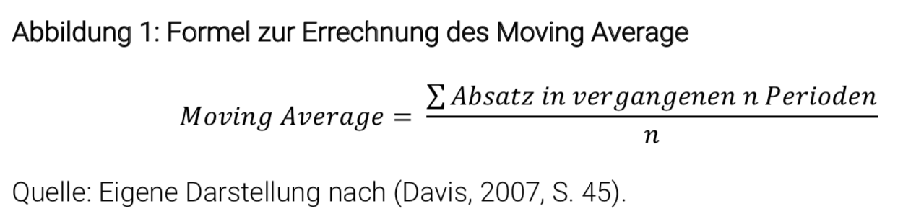
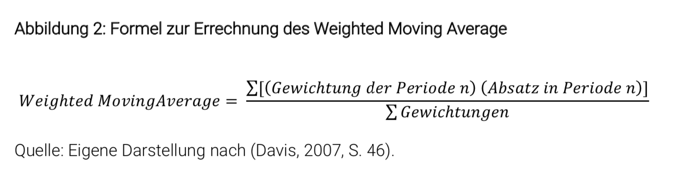
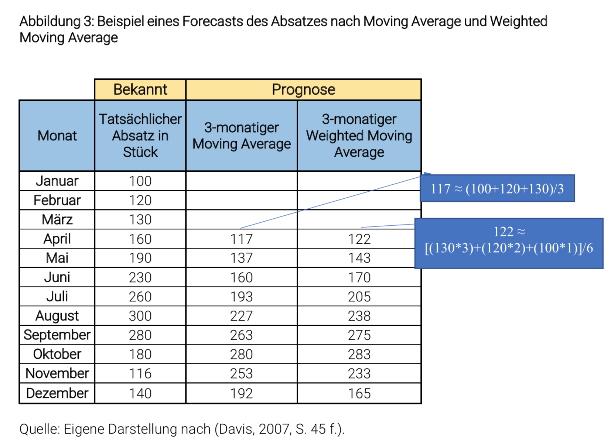

# Forecasting Methoden und Ihre Anwendung im Vertrieb

## 1. Einleitung: Weshalb sind Forecasting Methoden im Vertrieb notwendig?

Die Vertriebsabteilung bildet in einem Unternehmen eine zentrale Schnittstelle, die mit mehreren Abteilungen wie der Logistik oder der Produktion im konstanten Informationsaustausch steht. Daher ist es für den nachhaltigen Erfolg eines Unternehmens wichtig, dass alle Abteilungen gegenwertige und zukünftige Vertriebsergebnisse erhalten, um mögliche Risiken zu identifizieren und beheben zu können. Je präziser diese Prognosen von Absatzzahlen und Umsatzzahlen sind, desto geringer ist das Risiko für eine Überproduktion und dadurch resultierende Restbestände (Kühnapfel, 2013, S. 24). Deshalb bilden Prognosen des Vertriebs den Beginn verschiedener Planungsprozesse in abhängigen Abteilungen, die ihre eigene Planung auf der Prognose aus dem Vertrieb aufbauen. In der englisch sprachigen Literatur werden Verkaufsprognosen als Sales Forecasting bezeichnet und werden als Synonyme angesehen. Verkaufsprognosen befassen sich mit der Fragestellung: Wie ist es möglich bestimmte Kennzahlen wie Absatz- oder Umsatzzahlen möglichst genau zu prognostizieren? (Kühnapfel, 2015, S. 18 f.).
Bei einer Prognose handelt es sich allerdings immer um eine Schätzung, ob ein gewisses Szenario eintreten- und welcher Wert diesem Szenario zugeschrieben wird. Eine Prognose ist keine konkrete Vorhersage zukünftiger Ereignisse, da unbekannte Variablen zu Abweichungen führen können (Kühnapfel, 2015, S. 19 f.).
Dies führt dazu, dass insbesondere Vertriebsprognosen in der Praxis einem gewissen Stigma unterliegen. Es entsteht dabei der Eindruck, dass Vertriebsprognosen aufgrund von Zielvorgaben einen Wetten- und Glücksspiel Charakter aufweisen. (Kühnapfel, 2015, S. 19 f.). Nur in einer geringen Anzahl von Unternehmen erfolgt eine genaue Überprüfung der Verkaufsprognosen und daraus resultierende Verbesserungsvorschläge (Kühnapfel, 2015, S. 19). Dabei ist es für das jeweilige Unternehmen von Vorteil, Verkaufsprognosen zu optimieren und einen Prognoseprozess, der mehrere abhängige Abteilungen umfasst, zu etablieren. Ein Beispiel für eine erfolgreiche Anwendung eines solchen Prognoseprozesses findet sich in den 90er Jahren bei der Walmart Group in den USA. Das sogenannte CPFR (Collaborative Planning, Forecasting and Replenishment) umfasste mehrere Abteilungen, welche die Verkaufsprognosen verbessern sollte. Durch diese Maßnahme wurden die Verkaufsprognosen durchschnittlich um 20-30% verbessert (Kühnapfel, 2015, S. 45 ff.).
Diese Hausarbeit beinhaltet eine Übersicht von Anforderungen, die eine Prognose erfüllen muss, um ein möglichst genaues Ergebnis zu erhalten. Im folgenden Abschnitt wird die Moving-Average Methode exemplarisch anhand eines fiktiven Beispiels angewandt. Im letzten Abschnitt wird auf Ergebnisse aus einer praktischen Studie und deren Erkenntnisse eingegangen.

## 2. Anforderungen an die Erstellung einer Prognose

Bevor eine Prognose erstellt wird, sollte zunächst geklärt werden, welche Anforderungen eine Prognose erfüllen muss. Kühnapfel (2015, S. 39 f.) hat eine Übersicht mit acht Anforderungen erstellt:

1. Unternehmen sollen mehrere Prognosen erstellen und deren Ergebnisse miteinander vergleichen und kombinieren.
2. Der Forecaster muss die fachliche Kompetenz besitzen, um die Prognose durchführen zu können und Unterstützung aus anderen Fachabteilungen zu erhalten.
3. Im Verlauf des Prognoseprozesses sollen zunächst, nach dem Bottom-Up Prinzip, einzelne Teilprobleme gelöst werden, um das Gesamtproblem zu lösen.
4. Eine Überprüfung der Prognosen soll durchgeführt werden, um die Prognosegenauigkeit zu bestimmen.
5. Basierend auf der Überprüfung zur Prognosegenauigkeit wird der Forecaster und sein Team nach festgelegten Kriterien des Unternehmens bewertet.
6. Der Forecaster muss versuchen eine genauere Prognose zu erstellen als konkurrierende Unternehmen, um einen Wettbewerbsvorteil zu generieren.
7. Der Forecaster muss erkennen, ob es sich um kurzfristige Schwankungen oder nachhaltige Trends handelt.
8. Der Forecaster soll weder eigene Vermutungen noch Vertriebsziele durch eine Prognose bestätigen wollen. Ein höheres Maß an Objektivität erhöht die Genauigkeit der Prognose.
   Zudem stellt Kühnapfel (2015, S. 39 f.) fest, dass es zwar zur Erstellung von Forecasts bereits technische Hilfsmittel existieren, aber sich bislang noch nicht durchsetzen konnten. Begründet wird seine Aussage dadurch, dass die Programme zwar einzelne Anwendungen erleichtern, aber nicht maßgeblich an der Genauigkeit der Prognose etwas ändern können. Außerdem kann die Berechnung der meisten Forecasting Methoden aus der Praxis, wie im folgenden Kapitel gezeigt wird, per Microsoft Excel ausgewertet werden (Kühnapfel, 2015, S. 40).

## 3. Anwendung der Moving Average Methode anhand eines praktischen Beispiels

In der Literatur existieren viele unterschiedliche Methoden zur Bestimmung eines Forecasts. Die Anwendung der Methoden variiert von simplen bis hin zu komplexeren Berechnungen. Die exemplarisch ausgewählte Moving Average Methode ist eine einfache Methode zur Bestimmung eines Forecasts und basiert auf bereits bekannten historischen Daten (siehe Abb.1) (Johnston & Marshall, 2016, S. 145 f.). Sie ist eine der bekanntesten Forecasting Methoden und wird von klein- und mittelständischen Unternehmen verwendet (Johnston & Marshall, 2016, S. 145 f.). Auf Grund dessen wird die Methode in einem fiktiven Beispiel näher erläutert. Die Moving Average Methode eignet sich, um einen kurzfristigen Forecast für die nächsten 6 bis 12 Monate zu erstellen. (Del Rocio Castillo et al., 2016, S. 59). Diese Art der Forecast Berechnung eignet sich außerdem dazu, einzelne Produkte oder Produktgruppen miteinander zu vergleichen (Lee et al., 2012, S. 146).

Die Berechnung des Moving Average sollte durch eine Gewichtung ergänzt werden, die ältere Daten aus früheren Zeitperioden schwächer gewichtet und in der aktuellere Daten als aussagekräftiger betrachtet werden (siehe Abb. 2) (Davis, 2007, S. 45 f.).
Die Ergebnisse werden in tabellarischer Form festgehalten und per Microsoft-Excel errechnet (siehe Abbildung 3). Ein Vorteil dieser Methode ist es, dass die Anwendung und Auswertung, im Vergleich zu anderen Methoden, weniger Zeit beansprucht (Davis, 2007, S. 45 f.). Kleinere Unternehmen mit begrenzten Ressourcen im Vertrieb stellt diese Methode eine Lösung zur Berechnung dar. Die Berechnung der Methode berücksichtigt keine Trends oder saisonalen Veränderungen. Ein Nachteil an der Moving Average Methode besteht darin, dass bei der gewichteten Berechnung, die Höhe der Gewichtung auf der Erfahrung und Intuition des jeweiligen Sales Mitarbeiters basiert. Dies resultiert darin, dass das Ergebnis subjektiv geprägt ist (Del Rocio Castillo et al., 2016, S. 59 f.).
Im folgenden fiktiven Beispiel wird die Moving Average Methode genutzt, um den Absatz eines Produktes für die Monate April bis Dezember zu prognostizieren. In diesem Beispiel werden die bereits bekannten Daten von Januar bis März genutzt, um einen 3- monatigen Moving Average zu erstellen (Abbildung 1).

Diese Berechnung wird durch einen Weighted Moving Average ergänzt (Abbildung 2), damit die Ergebnisse verglichen werden können. Dabei wird der Monat März mit dem Faktor 3, Februar mit Faktor 2 und Januar mit Faktor 1 bewertet (Abbildung 3).

Wie in Abbildung 3 (Spalte Prognose) dargestellt, ergeben sich unterschiedliche Ergebnisse bei der Moving Average und der Weighted Moving Average Methode für jeden Monat. Bis auf den Monat Dezember wird beim Weighted Moving Average ein höherer Absatz prognostiziert als bei der Moving-Average Methode. Durch die Berücksichtigung, dass Daten aus dem letzten Monat höher bewertet werden, verändern sich die Ergebnisse nicht grundlegend, allerdings ist eine Abweichung zur ungewichteten Methode erkennbar. Anhand von durchgeführten Studien (Davis, 2007, S. 45 ff.) ist zu erkennen, dass der Weighted Moving Averages durch die Gewichtung eine genauere Prognose erstellt als der normale Moving Average.

Die Ausarbeitung zeigt, dass die Moving Average Methode einen ersten Überblick und einen Startpunkt für eine Prognose bildet. Für eine genauere Prognose des Absatzes empfiehlt es sich, wie in Anforderung 1 beschrieben (Kapitel 2.1), weitere Prognosen wie beispielsweise eine Regressionsanalyse durchzuführen. Diese Analysen sind komplexer und erfordern einen höheren Zeitaufwand, können aber dennoch die Genauigkeit der Prognose verbessern (Lee et al., 2012, S. 145 f.). Im Beispiel von Lee (et al. 2012, S. 145 f.) wurden für die Verkaufsprognose von Sushi und Sandwiches in Taiwan, drei Forecasting Methoden angewandt. Die getesteten Methoden umfassten die Moving Average Berechnung (ohne Gewichtung), die BPNN (Back-Propagation Neural Network) Berechnung und eine lineare Regressionsanalyse. Die BPNN und Regressionsanalyse enthalten komplexere Berechnungen als die Moving Average Methode und können Trends mit der Einbeziehung von Wahrscheinlichkeiten erfassen. Sie kamen zu dem Ergebnis, dass die Lineare Regressionsanalyse, mit einer Prognosegenauigkeit von fast 80 Prozent, die genauesten Ergebnisse ermitteln konnte. Bei zwei der neun getesteten Produkte ließ sich feststellen, dass die Moving Average Methode die genaueste Verkaufsprognose ermittelt hat. Für alle neun Produkte lag die durchschnittliche Prognosegenauigkeit bei nur knapp über 50 Prozent. Die BPNN Methode erzielte die durchschnittlich schlechteste Genauigkeitsquote der aufgeführten Methoden mit knapp 22 Prozent (Lee et al., 2012, S. 146).

## 4. Zusammenfassung

Es ist für ein Unternehmen unwahrscheinlich eine hundertprozentig genaue Prognose zu erstellen, da es in der Zukunft viele unbekannte Faktoren gibt, die die Ergebnisse beeinflussen können. Dennoch sind Verkaufsprognosen für den Vertrieb unverzichtbar, da sie die Entscheidungsgrundlage für Planungen anderer Abteilungen bildet und dazu beitragen kann die Kosten genauer zu bestimmen und zu reduzieren.
Um eine möglichst genaue Prognose zu erstellen, müssen acht Anforderungen erfüllt werden, damit die Objektivität der Ergebnisse gewahrt wird und dadurch die Genauigkeit der Prognose steigt. In der Praxis werden im Vertrieb, aufgrund des Zeitaufwandes, einfache Forecasting Methoden wie der Moving Average angewandt, um Umsatz- oder Absatzzahlen zu bestimmen. Wie einzelne Studien zeigen, erhält man durch den Einsatz der Moving Average Methode nicht die genauesten Ergebnisse, sondern lediglich eine Übersicht wie sich der Absatzmenge und Umsatz entwickeln könnten (Lee et al., 2012, S.146). Durch den Vergleich mit anderen Methoden wie der Linearen Regressionsanalyse wurde deutlich, dass komplexere Ansätze eine höhere Genauigkeit aufweisen (Lee et al., 2012, S. 146). Vertriebsabteilungen sollten daher mehrere Prognose Methoden erarbeiten, vergleichen und überprüfen, um herauszufinden welche Methode die höchste Genauigkeitsquote aufweist.

## 5. Literaturverzeichnis

Davis, J. (2007). Magic Numbers for Sales Management - Key Measures to Evaluate Sales Success. Singapur: John Wiley & Sons (Asia) Pte Ltd.

Del Rocio Castillo, E., Chain Palavicini, M., Del Rio Soto, R., & Cruz Gomez, J. (2016, Mai 19). Double Weighted Moving Average: Alternative Technique for Chemicals Supplier’s Sales Forecast. International Journal of Business Administration, S. 58-66.

Johnston, M. W., & Marshall, G. W. (2016). Sales Force Management - Leadership, Innovation, Technology (12. Auflage). New York: Routledge.

Kühnapfel, J. B. (2013). Vertriebscontrolling: Methoden im praktischen Einsatz (2. Auflage). Wiesbaden: Springer.

Kühnapfel, J. B. (2015). Vertriebsprognosen: Methoden für die Praxis. Wiesbaden: Springer.

Lee, W. I., Chen, C.-W., Chen, K.-H., Chen, T.-H., & Liu, C.-C. (2012). A Comparative
Study On The Forecast Of Fresh Food Sales Using Logistic Regression, Moving Average And BPNN Methods. Journal of Marine Science and Technology, S. 142- 152.
